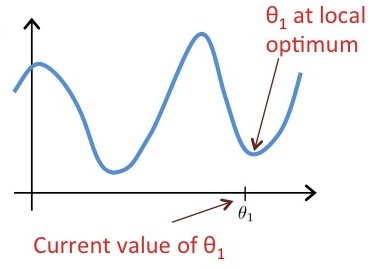

##  Introduction
  
  
 **What is machine learning**
  
Even among machine learning practitiones, there isn't a well accepted definition of what is and what isn't machine learning.
  
**Definitions**
  
_Arthur Samuel (1959)_
  
> Machine Learning is the field of study that gives computers the ability to learn without being explicitly learned.
  
_Tom Mitchell(1998) - Better one_
  
> A computer program is said to learn from experience E with respect to some class of tasks T and performance measure P, if its performance at tasks in T, as measured by P, improves with experience E.
  
Example: Playing checkers
  
* E: the experience of playing many games of checkers
* T: the task of playing checkers
* P: the probability that the program will win the next game
  
---
  
**Question**
  
Suppose your email program watches which emails you do or do not mark as spam, and based on that learns how to better filter spam. What is task T in this setting?
  
_Answer:_ Classifying emails as spam or not spam.
  
---
  
In general, any machine learning problem can be assigned to one of two broad classifications:
  
Supervised learning and Unsupervised learning.
  
###  Supervised learning
  
  
In supervised learning, we are given a data set and already know what our correct output should look like, having the idea that there is a relationship between the input and the output.
  
Supervised learning problems are categorized into "regression" and "classification" problems. In a regression problem, we are trying to predict results within a continuous output, meaning that we are trying to map input variables to some continuous function. In a classification problem, we are instead trying to predict results in a discrete output. In other words, we are trying to map input variables into discrete categories.
  
Example 1:
  
Given data about the size of houses on the real estate market, try to predict their price. Price as a function of size is a continuous output, so this is a regression problem.
  
We could turn this example into a classification problem by instead making our output about whether the house "sells for more or less than the asking price." Here we are classifying the houses based on price into two discrete categories.
  
Example 2:
  
(a) Regression - Given a picture of a person, we have to predict their age on the basis of the given picture
  
(b) Classification - Given a patient with a tumor, we have to predict whether the tumor is malignant or benign.
  
---
  
**Question**
  
You're running a company, and you want to develop learning algorithms to address each of two problems.
  
Problem 1: You have a large inventory of identical items. You want to predict how many of these items will sell over the next 3 months.
  
Problem 2: You'd like software to examine indiviudal customer accouncts, and for each account decide if it has been hacked/compromised.
  
Should you treat these as a classification or regression problem?
  
_Answer:_ Treat prblem 1 as a regression problem and problem 2 as a classification problem.
  
---
  
###  Unsupervised Learning
  
  
Unsupervised learning allows us to approach problems with little or no idea what our results should look like. We can derive structure from data where we don't necessarily know the effect of the variables.
  
We can derive this structure by clustering the data based on relationships among the variables in the data.
  
With unsupervised learning there is no feedback based on the prediction results.
  
Example:
  
Clustering: Take a collection of 1,000,000 different genes, and find a way to automatically group these genes into groups that are somehow similar or related by different variables, such as lifespan, location, roles, and so on.
  
Non-clustering: The "Cocktail Party Algorithm", allows you to find structure in a chaotic environment. (i.e. identifying individual voices and music from a mesh of sounds at a cocktail party).
  
---
  
**Question**
  
Of the following examples, which would you address using an unsupervised learning algorithm? (Check all that apply.)
  
_Answer:_ 
  
Correct: 
  
* Given a set of news articles found on the web, group them into sets of articles about the same stories.
* Given a database of customer data, automatically discover market segments and group customers into different market segments.
  
Un-Correct:
  
* Given email labeled as spam/not spam, learn a spam filter.
* Given a dataset of patients diagnosed as either having diabetes or not, learn to classify new patients as having diabetes or not.
  
  
---
  
##  Model and Cost Function
  
  
### Model Representation
  
  
To establish notation for future use, we’ll use x<sup>(i)</sup> to denote the “input” variables (living area in this example), also called input features, and y<sup>(i)</sup> to denote the “output” or target variable that we are trying to predict (price).
  
A pair (x<sup>(i)</sup>, y<sup>(i)</sup>) is called a training example, and the dataset that we’ll be using to learn—a list of m training examples (x<sup>(i)</sup>, y<sup>(i)</sup>); i=1,..,m is called a training set. Note that the superscript “(i)” in the notation is simply an index into the training set, and has nothing to do with exponentiation. We will also use X to denote the space of input values, and Y to denote the space of output values.
  
To describe the supervised learning problem slightly more formally, our goal is, given a training set, to learn a function h : X → Y so that h(x) is a “good” predictor for the corresponding value of y. For historical reasons, this function h is called a hypothesis. Seen pictorially, the process is therefore like this:
  

  
When the target variable that we’re trying to predict is continuous, such as in our housing example, we call the learning problem a regression problem. When y can take on only a small number of discrete values (such as if, given the living area, we wanted to predict if a dwelling is a house or an apartment, say), we call it a classification problem.
  
### Cost Function 
  
  
We can measure the accuracy of our hypothesis function by using a cost function. This takes an average difference (actually a fancier version of an average) of all the results of the hypothesis with inputs from x's and the actual output y's.
  
<p align="center"></p>  
  
  
To break it apart, it is <p align="center"></p>  
 where <p align="center"></p>  
 is the mean of the squares of <p align="center"></p>  
 , or the difference between the predicted value and the actual value.
  
This function is otherwise called the "Squared error function", or "Mean squared error". The mean is halved **(1/2)** as a convenience for the computation of the gradient descent, as the derivative term of the square function will cancel out the **1/2** term. The following image summarizes what the cost function does:
  

  
---
  
**Question**
  
Consider the plot below of h<sub>θ</sub>(x) = θ<sub>0</sub> + θ<sub>1</sub> x?
  

  
_Answer:_ θ<sub>0</sub>=0.5, θ<sub>1</sub> = 1
  
  
###  Cost function Intuition
  
  
If we try to think of it in visual terms, our training data set is scattered on the x-y plane. We are trying to make a straight line (defined by <p align="center"></p>  
) which passes through these scattered data points.
  
Our objective is to get the best possible line. The best possible line will be such so that the average squared vertical distances of the scattered points from the line will be the least. Ideally, the line should pass through all the points of our training data set. In such a case, the value of  <p align="center"></p>  
  
  
The following example shows the ideal situation where we have a cost function of 0.
  

  
When <p align="center"></p>  
, we get a slope of 1 which goes through every single data point in our model. Conversely, when <p align="center"></p>  
, we see the vertical distance from our fit to the data points increase.
  

  
This increases our cost function to 0.58. Plotting several other points yields to the following graph:
  

  
Thus as a goal, we should try to minimize the cost function. In this case, <p align="center"></p>  
 is our global minimum.
  
--- 
  
**Question**
  
Suppose we have a training set with m=3 examples, plotted below. Our hypothesis representation is <p align="center"></p>  
  
  
The cost of the function <p align="center"></p>  
 is
<p align="center"></p>  
  
Whats is `J(0)`?
  

  
_Answer:_  14/6
  
---
  
A contour plot is a graph that contains many contour lines. A contour line of a two variable function has a constant value at all points of the same line. An example of such a graph is the one to the right below.
  

  
Taking any color and going along the 'circle', one would expect to get the same value of the cost function. For example, the three green points found on the green line above have the same value for <p align="center"></p>  
 and as a result, they are found along the same line. The circled x displays the value of the cost function for the graph on the left when <p align="center"></p>  
 and <p align="center"></p>  
  
  
Taking another h(x) and plotting its contour plot, one gets the following graphs:
  

  
  
When <p align="center"></p>  
 and <p align="center"></p>  
, the value of <p align="center"></p>  
 in the contour plot gets closer to the center thus reducing the cost function error. Now giving our hypothesis function a slightly positive slope results in a better fit of the data.
  

  
The graph above minimizes the cost function as much as possible and consequently, the result of <p align="center"></p>  
 tend to be around 0.12 and 250 respectively. Plotting those values on our graph to the right seems to put our point in the center of the inner most 'circle'.
  
##  Parameter Learning
  
  
###  Grandient Descent
  
  
So we have our hypothesis function and we have a way of measuring how well it fits into the data. Now we need to estimate the parameters in the hypothesis function. That's where gradient descent comes in.
  
Imagine that we graph our hypothesis function based on its fields <p align="center"></p>  
 and <p align="center"></p>  
(actually we are graphing the cost function as a function of the parameter estimates). We are not graphing x and y itself, but the parameter range of our hypothesis function and the cost resulting from selecting a particular set of parameters.
  
We put <p align="center"></p>  
 on the x axis and <p align="center"></p>  
 on the y axis, with the cost function on the vertical z axis. The points on our graph will be the result of the cost function using our hypothesis with those specific theta parameters. The graph below depicts such a setup.
  

  
We will know that we have succeeded when our cost function is at the very bottom of the pits in our graph, i.e. when its value is the minimum. The red arrows show the minimum points in the graph.
  
The way we do this is by taking the derivative (the tangential line to a function) of our cost function. The slope of the tangent is the derivative at that point and it will give us a direction to move towards. We make steps down the cost function in the direction with the steepest descent. The size of each step is determined by the parameter α, which is called the learning rate.
  
For example, the distance between each 'star' in the graph above represents a step determined by our parameter α. A smaller α would result in a smaller step and a larger α results in a larger step. The direction in which the step is taken is determined by the partial derivative of <p align="center"></p>  
. Depending on where one starts on the graph, one could end up at different points. The image above shows us two different starting points that end up in two different places.
  
The gradient descent algorithm is:
  
repeat until convergence:
  
<p align="center"></p>  
  
  
where
  
j=0,1 represents the feature index number.
  
At each iteration j, one should simultaneously update the parameters θ<sub>1</sub>, θ<sub>2</sub>, ..., θ<sub>n</sub>. Updating a specific parameter prior to calculating another one on the j<sup>(th)</sup> iteration would yield to a wrong implementation.
  

  
---
  
**Question**
  
Suppose <p align="center"></p>  
, and we simultaneously update <p align="center"></p>  
 using the rule: <p align="center"></p>  
 What are the resulting values of <p align="center"></p>  
  
  
_Answer:_ <p align="center"></p>  
  
  
  
---
  
###  Grandient Descent Intuition
  
  
In this video we explored the scenario where we used one parameter θ1 and plotted its cost function to implement a gradient descent. Our formula for a single parameter was :
  
Repeat until convergence:
  
<p align="center"></p>  
  
  
Regardless of the slope's sign for <p align="center"></p>  
 eventually converges to its minimum value. The following graph shows that when the slope is negative, the value of θ1 increases and when it is positive, the value of θ1 decreases.
  

  
On a side note, we should adjust our parameter \alphaα to ensure that the gradient descent algorithm converges in a reasonable time. Failure to converge or too much time to obtain the minimum value imply that our step size is wrong.
  

  
How does gradient descent converge with a fixed step size α?
  
The intuition behind the convergence is that <p align="center"></p>  
 approaches 0 as we approach the bottom of our convex function. At the minimum, the derivative will always be 0 and thus we get:
  
<p align="center"></p>  
  
  

  
---
  
**Question**
  
Suppose <p align="center"></p>  
 is at a local optimum of <p align="center"></p>  
, such as shown in the figure. What will one step of gradient descent
  
<p align="center"></p>  
  
  
do?
  

  
_Answer:_  Leave θ1 unchanged
  
---
  
###  Gradient Descent for Linear Regression
  
  
When specifically applied to the case of linear regression, a new form of the gradient descent equation can be derived. We can substitute our actual cost function and our actual hypothesis function and modify the equation to :
  
<p align="center"></p>  
  
  
where m is the size of the training set, θ0 a constant that will be changing simultaneously with θ1 we are multiplying xi at the end due to the derivative. The following is a derivation of <p align="center"></p>  
  
for a single example :
  

  
The point of all this is that if we start with a guess for our hypothesis and then repeatedly apply these gradient descent equations, our hypothesis will become more and more accurate.
  
So, this is simply gradient descent on the original cost function J. This method looks at every example in the entire training set on every step, and is called batch gradient descent. Note that, while gradient descent can be susceptible to local minima in general, the optimization problem we have posed here for linear regression has only one global, and no other local, optima; thus gradient descent always converges (assuming the learning rate α is not too large) to the global minimum. Indeed, J is a convex quadratic function. Here is an example of gradient descent as it is run to minimize a quadratic function.
  

  
The ellipses shown above are the contours of a quadratic function. Also shown is the trajectory taken by gradient descent, which was initialized at (48,30). The x’s in the figure (joined by straight lines) mark the successive values of θ that gradient descent went through as it converged to its minimum.
  
---
  
**Question**
  
Which of the following are true statements? Select all that apply.
  
  
_Answer:_
  
_Correct_
  
* Gradient descent can converge even if α is kept fixed. (But α cannot be too large, or else it may fail to converge.)
* For the specific choice of cost function <p align="center"></p>  
 used in linear regression, there are no local optima (other than the global optimum).
  
_Incorrect_
  
* To make gradient descent converge, we must slowly decrease α over time.
* Gradient descent is guaranteed to find the global minimum for any function <p align="center"></p>  
  
---
  
##  Linear Algebra
  
  
###  Matrices and vectors
  
  
###  Matrices
  
Dimension of matrix: number of rows x number of columns
  
<p align="center"></p>  
  
  
This example, this has 1, 2, 3, 4 rows and has 2 columns, and so this example  is a 4 by 2 matrix <p align="center"></p>  
  - number of rows by number of columns.
  
**Matrix Elements(entries of matrix)**
  
<p align="center"></p>  
  
  
For example:
  
<p align="center"></p>  
  
  
###  Vectors
  
  
**Vector** An n x 1 matrix
  
<p align="center"></p>  
  
  
For example:
  
<p align="center"></p>  
  
  
**Notation and terms:**
  
* A<sub>ij</sub> refers to the element in the ith row and jth column of matrix A.
* A vector with 'n' rows is referred to as an 'n'-dimensional vector.
* v<sub>i</sub> refers to the element in the ith row of the vector.
* In general, all our vectors and matrices will be 1-indexed. Note that for some programming languages, the arrays are 0-indexed.
* Matrices are usually denoted by uppercase names while vectors are lowercase.
* "Scalar" means that an object is a single value, not a vector or matrix.
* R refers to the set of scalar real numbers.
* R<sup>n</sup> refers to the set of n-dimensional vectors of real numbers.
  
```
% The ; denotes we are going back to a new row.
A = [1, 2, 3; 4, 5, 6; 7, 8, 9; 10, 11, 12]
  
% Initialize a vector 
v = [1;2;3] 
  
% Get the dimension of the matrix A where m = rows and n = columns
[m,n] = size(A)
  
% You could also store it this way
dim_A = size(A)
  
% Get the dimension of the vector v 
dim_v = size(v)
  
% Now let's index into the 2nd row 3rd column of matrix A
A_23 = A(2,3)
```
  
###  Addition and Scalar Multiplication
  
  
**Matrix Addition**
  
Addition and subtraction are element-wise, so you simply add or subtract each corresponding element:
  
<p align="center"></p>  
  
  
To add or subtract two matrices, their dimensions must be **the same**.
  
**Scalar Multiplication**
  
In scalar multiplication and division you make the operation element-wise.
  
<p align="center"></p>  
  
  
Experiment below with the Octave/Matlab commands for matrix addition and scalar multiplication. Feel free to try out different commands. Try to write out your answers for each command before running the cell below.
  
```
% Initialize matrix A and B 
A = [1, 2, 4; 5, 3, 2]
B = [1, 3, 4; 1, 1, 1]
  
% Initialize constant s 
s = 2
  
% See how element-wise addition works
add_AB = A + B 
  
% See how element-wise subtraction works
sub_AB = A - B
  
% See how scalar multiplication works
mult_As = A * s
  
% Divide A by s
div_As = A / s
  
% What happens if we have a Matrix + scalar?
add_As = A + s
```
  
**Matrix-vector multiplication**
  
We map the column of the vector onto each row of the matrix, multiplying each element and summing the result.
  
<p align="center"></p>  
  
  
The result is a vector. The number of columns of the matrix must equal the number of rows of the vector.
  
An m x n matrix multiplied by an n x 1 vector results in an m x 1 vector.
  
For example:
  
<p align="center"></p>  
  
  
<p align="center"></p>  
  
  
Below is an example of a matrix-vector multiplication. Make sure you understand how the multiplication works. Feel free to try different matrix-vector multiplications.
  
```
% Initialize matrix A 
A = [1, 2, 3; 4, 5, 6;7, 8, 9] 
  
% Initialize vector v 
v = [1; 1; 1] 
  
% Multiply A * v
Av = A * v
```
  
###  Matrix Matrix Multiplication
  
  
We multiply two matrices by breaking it into several vector multiplications and concatenating the result.
  
<p align="center"></p>  
  
  
An m x n matrix multiplied by an n x o matrix results in an m x o matrix. In the above example, a 3 x 2 matrix times a 2 x 2 matrix resulted in a 3 x 2 matrix.
  
To multiply two matrices, the number of columns of the first matrix must equal the number of rows of the second matrix.
  
For example:
  
```
% Initialize a 3 by 2 matrix 
A = [1, 2; 3, 4;5, 6]
  
% Initialize a 2 by 1 matrix 
B = [1; 2] 
  
% We expect a resulting matrix of (3 by 2)*(2 by 1) = (3 by 1) 
mult_AB = A*B
  
% Make sure you understand why we got that result
```
  
###  Matrix Multiplication Properties
  
  
**Commutative**
  
Let A and B be matrices. Then in general, 
  
<p align="center"></p>  
  
  
  
**Associative**
  
<p align="center"></p>  
  
  
**Identity Matrix**
  
The identity matrix, when multiplied by any matrix of the same dimensions, results in the original matrix. It's just like multiplying numbers by 1. The identity matrix simply has 1's on the diagonal (upper left to lower right diagonal) and 0's elsewhere.
  
<p align="center"></p>  
  
  
When multiplying the identity matrix after some matrix (A∗I), the square identity matrix's dimension should match the other matrix's columns. When multiplying the identity matrix before some other matrix (I∗A), the square identity matrix's dimension should match the other matrix's rows.
  
```
% Initialize random matrices A and B 
A = [1,2;4,5]
B = [1,1;0,2]
  
% Initialize a 2 by 2 identity matrix
I = eye(2)
  
% The above notation is the same as I = [1,0;0,1]
  
% What happens when we multiply I*A ? 
IA = I*A 
  
% How about A*I ? 
AI = A*I 
  
% Compute A*B 
AB = A*B 
  
% Is it equal to B*A? 
BA = B*A 
  
% Note that IA = AI but AB != BA
```
  
###  Inverse and Transpose
  
  
The inverse of a matrix A is denoted <p align="center"></p>  
. Multiplying by the inverse results in the identity matrix.
  
A non square matrix does not have an inverse matrix. We can compute inverses of matrices in octave with the pinv(A)pinv(A) function and in Matlab with the inv(A)inv(A) function. Matrices that don't have an inverse are singular or degenerate.
  
The transposition of a matrix is like rotating the matrix 90° in clockwise direction and then reversing it. We can compute transposition of matrices in matlab with the transpose(A) function or A':
  
<p align="center"></p>  
  
  
<p align="center"></p>  
  
  
In other words:
  
<p align="center"></p>  
  
  
```
% Initialize matrix A 
A = [1,2,0;0,5,6;7,0,9]
  
% Transpose A 
A_trans = A' 
  
% Take the inverse of A 
A_inv = inv(A)
  
% What is A^(-1)*A? 
A_invA = inv(A)*A
```
  