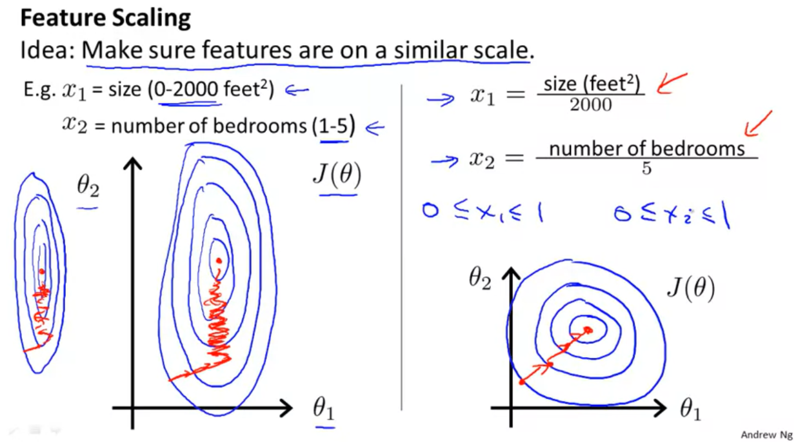
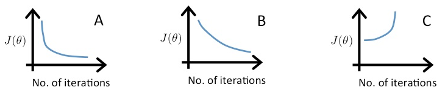

## Multivariate Linear Regression

### Multiple Features

_**Note: [7:25 - θT is a 1 by (n+1) matrix and not an (n+1) by 1 matrix]**_

Linear regression with multiple variables is also known as "multivariate linear regression".

We now introduce notation for equations where we can have any number of input variables.

| Size (feet^2)      | Number of bedrooms | Number of floors | Age of home (years) | Price ($1000) |
| ------------------ | ------------------ | ---------------- | ------------------- | ------------- |
| 2104               | 5                  | 1                | 45                  | 460           |
| 1416               | 3                  | 2                | 40                  | 232           |
| 1534               | 3                  | 2                | 30                  | 315           |
| 852                | 2                  | 1                | 36                  | 178           |
| ...                | ...                | ...              | ...                 | ...           |

\[\begin{aligned} x_j^{(i)} &= \text{value of feature } j \text{ in the }i^{th}\text{ training example} \\ x^{(i)}& = \text{the input (features) of the }i^{th}\text{ training example} \\ m &= \text{the number of training examples} \\ n &= \text{the number of features} \end{aligned}\]

$$x^{(2)} = \begin{bmatrix} 1416 \\ 3 \\ 2 \\ 40 \end{bmatrix}$$

That's an index into my training set. This is not X to the power of 2. Instead, this is, you know, an index that says look at the second row of this table. This refers to my second training example.

$$x^{(2)}_3 = 2$$

With this notation X2 is a four dimensional vector. In fact, more generally, this is an in-dimensional feature back there. With this notation, X2 is now a vector and so, I'm going to use also Xi subscript J to denote the value of the J, of feature number J and the training example.

---

**Question**

In the training set above, what is $$\nobreak x_1^{(4)}\text{?}$$

**Answer**

* The size (in feet^2) of the 1st home in the training set
* The age (in years) of the 1st home in the training set
* *(**Correct**) The size (in feet^2) of the 4th home in the training set*
* The age (in years) of the 4th home in the training set

---

**Form of hypothesis**

Previous form: 

$$
\xcancel{h_{\theta}{x} =\theta_0 + \theta_1 \ast x}
$$

Previously this was the form of our hypothesis, where x was our single feature, but now that we have multiple features, we aren't going to use the simple representation any more. Instead, a form of the hypothesis in linear regression is going to be this, can be theta 0 plus theta 1 x1 plus theta 2 x2 plus theta 3x3 plus theta 4 X4. And if we have N features then rather than summing up over our four features, we would have a sum over our N features.

$$
h_{\theta}{x} =\theta_0 + \theta_1 \ast x_1  + \theta_2 \ast x_2 + \dotsb +  + \theta_n \ast x_n
$$

For convieniece of notation, define x0 = 1. So now my feature vector X becomes this N+1 dimensional:

$$
x = \begin{bmatrix} x_0 \\ x_1 \\  x_2 \\ \dotsb \\ x_n \end{bmatrix}\in\R^{n+1}
$$

My parameter vector would be:
 
$$
\theta = \begin{bmatrix} \theta_0 \\ \theta_1 \\ \theta_2 \\ \dotsb \\ \theta_n \end{bmatrix}\in\R^{n+1}
$$

So we conclude with the hypothesis:

\[\begin{aligned}
h_\theta(x) =\begin{bmatrix}\theta_0 \hspace{2em} \theta_1 \hspace{2em} ... \hspace{2em} \theta_n\end{bmatrix}\begin{bmatrix}x_0 \\ x_1 \\ \vdots \\ x_n\end{bmatrix}= \theta^T x\end{aligned}\]

### Gradient Descent for Multiple 

The gradient descent equation itself is generally the same form; we just have to repeat it for our 'n' features:

\[\begin{aligned}
 & \text{repeat until convergence:} \; \lbrace \\ \; & \theta_0 := \theta_0 - \alpha \frac{1}{m} \sum\limits_{i=1}^{m} (h_\theta(x^{(i)}) - y^{(i)}) \cdot x_0^{(i)}\\ \; & \theta_1 := \theta_1 - \alpha \frac{1}{m} \sum\limits_{i=1}^{m} (h_\theta(x^{(i)}) - y^{(i)}) \cdot x_1^{(i)} \\ \; & \theta_2 := \theta_2 - \alpha \frac{1}{m} \sum\limits_{i=1}^{m} (h_\theta(x^{(i)}) - y^{(i)}) \cdot x_2^{(i)} \\ & \cdots \\ \rbrace \end{aligned}\]

In other words:

\[\begin{aligned}
& \text{repeat until convergence:} \; \lbrace \\ \; & \theta_j := \theta_j - \alpha \frac{1}{m} \sum\limits_{i=1}^{m} (h_\theta(x^{(i)}) - y^{(i)}) \cdot x_j^{(i)} \; & \text{for j := 0...n}\\ \rbrace\end{aligned}\]

---

**Question**

When there are n features, we define the cost function as:

\[
J(\theta_0) = \dfrac {1}{2m} \sum _{i=1}^m (h_\theta (x^{(i)}) - y^{(i)})^2
\]

For linear regression, which of the following are also equivalent and correct definitions of J(θ)?

**Answer**

\[J(\theta) = \frac{1}{2m}\sum_{i = 1}^{m}( \theta^{T}x^{(i)} - y^{(i)})^{2}\]
\[J( \theta) = \frac{1}{2m}\sum_{i = 1}^{m}(( \sum_{j = 0}^{n}\theta_{j}x_{j}^{(i)}) - y^{(i)})^{2}\]

---

The following image compares gradient descent with one variable to gradient descent with multiple variables:

### Gradient Descent in Practice I - Feature Scaling

**Idea:** If you have a problem where you have multiple features, if you make sure that the features are on a similar scale, by which I mean make sure that the different features take on similar ranges of values, then gradient descents can converge more quickly.

For Example:

If you plot the contours of the cos function J of theta, then the contours may look like this, where, let's see, J of theta is a function of parameters theta zero, theta one and theta two. I'm going to ignore theta zero, so let's about theta 0 and pretend as a function of only theta 1 and theta 2, but if x1 can take on them, you know, much larger range of values and x2 It turns out that the contours of the cause function J of theta can take on this very very skewed elliptical shape.

And if you run gradient descents on this cos-function, your gradients may end up taking a long time and can oscillate back and forth and take a long time before it can finally find its way to the global minimum.

Concretely if you instead define the feature X one to be the size of the house divided by two thousand, and define X two to be maybe the number of bedrooms divided by five, then the count well as of the cost function J can become much more, much less skewed so the contours may look more like circles.

**Selection of the range**

Get every feautre int aproimately a  -1 <= xi <= 1 range.Ideally:

\[−1 \le x_{(i)} \le 1\]

or

\[−0.5 \le x_{(i)} \le 0.5\]

**Mean normalization**

Mean normalization involves subtracting the average value for an input variable from the values for that input variable resulting in a new average value for the input variable of just zero. To implement both of these techniques, adjust your input values as shown in this formula:

\[x_i := \frac{x_i - \mu_i}{s_i}\]
 
Where mu is the **average**  of all the values for feature (i) and s_i is the range of values (max - min), or s_i is the standard deviation. Note that dividing by the range, or dividing by the standard deviation, give different results. The quizzes in this course use range - the programming exercises use standard deviation.

For example, if x_i  represents housing prices with a range of 100 to 2000 and a mean value of 1000, then,

\[x_i := \frac{price - 1000}{1900}\]

---

**Question**

Suppose you are using a learning algorithm to estimate the price of houses in a city. You want one of your features x_i to capture the age of the house. In your training set, all of your houses have an age between 30 and 50 years, with an average age of 38 years. Which of the following would you use as features, assuming you use feature scaling and mean normalization?

**Answer:** \[x_i := \frac{\text{age of house} - 38}{20}\]

---

### Gradient Descent in Practice II - Learning Rate

Concretely, here's the gradient descent update rule. And what we want to do is to develop a debugging rule, and some tips for making sure that gradient descent is working correctly. And second, how to choose the learning rate alpha or at least how I go about choosing it. 

Here's something that I often do to make sure that gradient descent is working correctly. The job of gradient descent is to find the value of theta for you that hopefully minimizes the cost function J(theta). What I often do is therefore plot the cost function J(theta) as gradient descent runs. So the x axis here is a number of iterations of gradient descent and as gradient descent runs you hopefully get a plot that maybe looks like this.

***Warning: The J(theta) should decrease after every iteration.***

It has been proven that if learning rate α is sufficiently small, then J(θ) will decrease on every iteration.

To summarize:

* If alpha is too small: slow convergence.
* If alpha is too large: may not decrease on every iteration and thus may not converge.

---

**Question**

Suppose a friend ran gradient descent three times, with alpha = 0.01, alpha = 0.1, and alpha = 1, and got the following three plots (labeled A, B, and C):

Which plots corresponds to which values of alpha?

*Answer:* A is alpha=0.1, B is alpha = 0.001, C is alpha =1. 

> In graph C, the cost function is increasing, so the learning rate is set too high. Both graphs A and B converge to an optimum of the cost function, but graph B does so very slowly, so its learning rate is set too low. Graph A lies between the two.

---

To choose alpha, try an array of range of values: ..., 0.001, 0.003, 0.01, 0.03, 0,1, 0.3, 1, ...

### Features and Polynomial Regression

We can improve our features and the form of our hypothesis function in a couple different ways.

We can combine multiple features into one. For example, we can combine x_1 and x_2 into a new feature x_3 = x_1 * x_2.

**Polynomial Regression**

Our hypothesis function need not be linear (a straight line) if that does not fit the data well.

We can change the behavior or curve of our hypothesis function by making it a quadratic, cubic or square root function (or any other form).

For example, if our hypothesis function is \[h_\theta{x} = \theta_0 + \theta_1 x_1 + \theta_2 x_1^2 \] then we can create additional features based on x_1, to get the quadratic function or the cubic function \[h_\theta{x} = \theta_0 + \theta_1 x_1 + \theta_2 x_1^2 + \theta_3 x_1^3\]

In the cubic version, we have created new features x_2 and x_3 where \[x_2 = x_1^2\]
 and \[x_3 = x_1^3\].

 **NOTE!!! One important thing to keep in mind is, if you choose your features this way then feature scaling becomes very important.**

 eg. if x_1 has range 1 - 1000 then range of x_1^2 becomes 1 - 1000000 and that of x_1^3 becomes 1 - 1000000000.

 