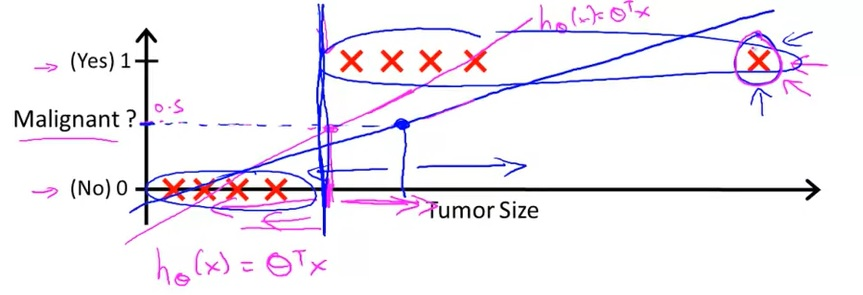
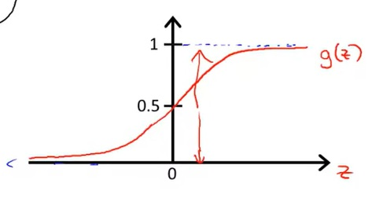
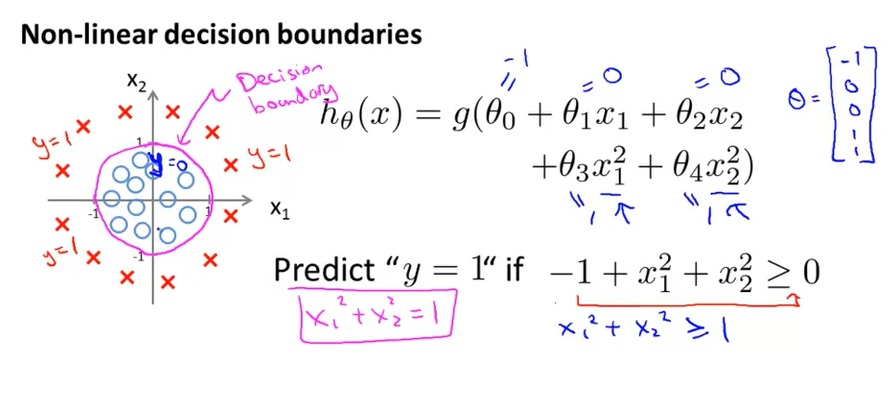

##  Classification and Representation
  
  
###  Classification
  
  
Examples of Classifications problems:
  
* Email: Spam / Not Spam
* Online Transactions: Fraudulent (Yes/No)
* Tumor: Malignant / Benign
  

  
  
  
**How do we develop a classification algorithm?**
  
I think that we could do is to apply the algorithm that we already know:
  

  
  
  

  
If you want to make predictions, one thing that we could do is to use a threshold classifier output at 0.5:
  

  
  
  
  
**Note:** For classification we know that y is either zero or one. But if you are using linear regression where the hypothesis can output values that are much larger than one or less than zero, even if all of your training examples have labels y equals zero or one.
  
###  Hypothesos Representation
  
  
We would like our classifier to output values between zero and one.
  
When we were using linear regression our hypothesis had the form of:
  

  
  
  
For logistic regression we will modify this a little bit and make the hypothesis g of theta transpose x. 
  

  
  
  
**Sigmoid \ Logistic Function**
  
The sigmoid function, while it asymptotes at one and asymptotes at zero, as a z axis, the horizontal axis is z. As z goes to minus infinity, g(z) approaches zero. And as g(z) approaches infinity, g(z) approaches one. And so because g(z) upwards values are between zero and one, we also have that h(x) must be between zero and one.
  

  
**Intepretation of Hypothesis Output**
  

  
  
  
Example:
  

  
  
  
h_theta will give us the probability that our output is 1. For example, h_theta = 0.7 gives us a probability of 70% that our output is 1. Our probability that our prediction is 0 is just the complement of our probability that it is 1 (e.g. if probability that it is 1 is 70%, then the probability that it is 0 is 30%).
  

  
  
  
##  Decision Boundary
  
  
In order to get our discrete 0 or 1 classification, we can translate the output of the hypothesis function as follows:
  

  
  
  
The way our logistic function g behaves is that when its input is greater than or equal to zero, its output is greater than or equal to 0.5:
  

  
  
  
Remember.
  

  
  
  
So if our input to g is theta^T X, then that means:
  

  
  
  
From these statements we can now say:
  

  
  
  
The **decision boundary** is the line that separates the area where y = 0 and where y = 1. It is created by our hypothesis function.
  
**Example:**
  

  
  
  
In this case, our decision boundary is a straight vertical line placed on the graph where x_1 = 5, and everything to the left of that denotes y = 1, while everything to the right denotes y = 0.
  
Again, the input to the sigmoid function g(z) (e.g. theta^T X) doesn't need to be linear, and could be a function that describes a circle (e.g. z = theta_0 + theta_1 x_1^2 + theta_2 x_2^2 ) or any shape to fit our data.
  

  